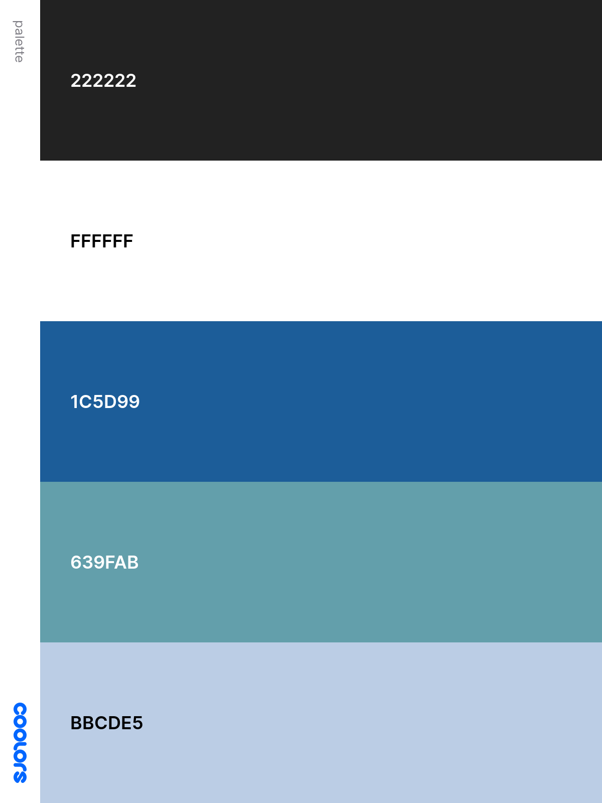

# Recall


[Link to the Live Project](https://github.com/SamBurgess93/Recall).

## Table of contents
1. [Introduction](#introduction)
2. [UX](#ux)
    1. [Project Goals](#project-goals)
    2. [User Stories](#user-stories)
    3. [Development Planes](#development-planes)
3. [Features](#features)
    1. [Existing Features](#existing-features)
    2. [Features to Implement in the future](#features-to-implement-in-the-future)
4. [Technologies Used](#technologies-used)
     1. [Main Languages Used](#main-languages-used)
     2. [Additional Languages Used](#additional-languages-used)
     3. [Frameworks and Programs Used](#frameworks-and-programs-used)
5. [Testing](#testing)
     1. [Testing planning](#testing-planning)
     2. [Execution](#execution)
6. [Results and outcomes](#results-and-outcomes)
     1. [Validator](#validator)
     2. [Lighthouse](#lighthouse)
7. [Bugs](#bugs)
8. [Deployment](#deployment)
     1. [Deploying on GitHub Pages](#deploying-on-github-pages)
     2. [Forking the Repository](#forking-the-repository)
     3. [Creating a Clone](#creating-a-clone)
9. [Credits](#credits)
     1. [Images](#images)
     2. [Code](#code)
10. [Acknowledgements](#acknowledgements)
***

## UX 
### Project Goals
The primary goal of RECALL is to provide a web-based interactive game, that is fun and intuitive, through a pattern memory game, designed to test the users ability to recall information thats shown to them.
 
This is my second Milestone Project that must be developed as part of my Full Stack software development course with Code Institute.

The main requirements were to design, develop and implement a dynamic front-end web application using **HTML5**, **CSS3** and **JavaScript**.

#### Player Goals
The player is looking for:
- An enjoyable and entertaining game to play, with clear instructions.
- High Score system that promotes the user to return to the game. 
- An intuitive and vibrant interface. 
- Visual and audio stimulation during play time.

#### Developer / Site Owner Goals
The Developer is looking to:
- Create a fun and entertaining game they would play themselves and share with their friends and family.
- Demonstrate their expertise using multiple software development skills, implementing newly learned languages with libraries and API's to create the finished product.
- Deploy a project they are proud and excited to have on their portfolio.

### User Stories
**As a player, I want to:**


1. Have the ability to create my own username, to personalise the experience.
2. Make the process of starting the game intuitive. 
3. To be able track my progress during the game, with a clear score counter.
4. Clearly know when my answers are correct/incorrect through visual and auditory feedback.
5. Have the ability to toggle sound effects on or off.
6. View the highest score for my session, using a high score counter.
7. Have control on what happens on the end each game, to either play again or end the session.
8. Connect with the developer on a social platform of my choosing to see their other projects.
9. Have the ability to communicate with the developer to provide feedback on the overall experience, to improve the game.
10. Have the option to play the game on any device, whether it be desktop, tablet or mobile phone.


### Development Planes

In order to design and create a web-based interactive game, the developer distinguished the required functionality of the site and how it would answer the user stories, as described above, using the **Five Development Planes**:

<strong>1. <u>Strategy</u></strong>

Broken into three categories, the website will focus on the following target audiences:
- **Roles:**
     - New Players
     - Current Players
     - Returning Players

- **Demographic:**
     - Puzzle game Lovers
     - Aged 10 years and up

- **Psychographics:**
     - Personality & Attitudes:
          - Fun-driven
          - Good memory
          - Competitive
    

The website needs to enable the **user** to:
- Play with ease, interacting without complications
- Control sound settings
- See Current and High Scores
- Get access to instructions if needed
- Provide suggestions and feedback to the developer
- Connect with developer through social links

The website needs to enable the **client** to:
- Enjoy playing their own game
- Allow for user feedback and suggestions
- Communicate with users on social links

<strong>2. <u>Scope</u></strong>

The scope was created from using the Strategy previously defined. This allowed us to align the features to deliver on the strategy. This was seperated into two categories:
- **Content Requirements**
     - The player will be looking for:
          - Dynamic and inviting visuals
          - Simple and vibrant content
          - Current and High scores
          - Creator information 

- **Functionality Requirements**
     - The user will be able to:
          - Play with ease
          - Access Current and High Scores
          - Reach out to the developer
               - Suggestions
               - Social links


<strong>3. <u>Structure</u></strong>

The information architecture was organized in a **hierarchial tree structure** in order to ensure that users could navigate through the site with ease and efficiency, with the following results: 


<strong>4. <u>Skeleton</u></strong>

Wireframe mockups were created in a [Figma Workspace](https://www.figma.com/file/vWfRZMJwTLShb5zcrlGXG4/RECALL?node-id=0%3A1 "Link to RECALL Figma Workspace") with providing a positive user experience in mind:

Main Page:
- Welcome Modal:


- Form:

     (assets/readme-files/form-mockup.png)

     <strong>5. <u>Surface</u></strong>


- <strong>Colour Scheme</strong>

     - I used the palette maker from the Coolors website to choose my color scheme.

     - The chosen colour scheme was specifically selected in order to define the tone of the game.

     - A General palette was created, with this atmosphere in mind, and was used in designing graphics and complimentary text colour:

          


- <strong>Typography</strong>

     - The primary font chosen is [Roboto](https://fonts.google.com/specimen/Roboto?preview.text_type=custom&query=roboto). A sans-serif typeface, Roboto is geometrically shaped and is easily readable.

     - The charismatic combination of the typefaces compliments the clean aesthetic and entertaining theme set by the colour palette.


[Back to top ⇧](#table-of-contents)

## **Features**
***

### **Existing Features**

Included in the **game** is:

* **Logo and developers name:** A logo telling the name of the game "RECALL" and who it is by.  
* **Start a game button:** To begin the game.  
* **How To Play button:** Where the user can click and a modal shows up explaining the way to interact with the game.
* **Contact button:** Where the user can click and modal pop up with a contact form and socials(leads to external sites). The user can then fill out the form with email and message query (with validation, “@” and “.” etc.) and submitted to contact the developer.
* **Option buttons:** To give the user options and make use of their decision-making skills. 
* **Try Again button:** In the end there will be an option to try the game again for a different outcome.
* **HighScore:** . 
* **Social Icons** -  The chosen social platforms are displayed using appropriate icons.
* **Time Counter** - A time counter, displaying the time elapsed since page load, gives users feedback on how long they have been playing, in minutes and seconds. This is then displayed at game end.
* **Session Storage** - The `sessionStorage` function is used to store user information such as **username**, player's **high score** and the chosen **user preferences**.
* **Current Score:** To tell the player what their live score is in real time.
* **404 page:** A message telling the user they have accessed a page that does not exist. Including a button that is linked to index.html that prompts them to return to the site.


### **Features Left to Implement**

* Add music for user experience.
* Add a more designed successful sent message when sending a message from the modal form. 
* **Beat The Clock**
     - Allowing users to race against the clock in their chosen category. 
     - The developer did try to implement this feature in the current release but it created a bug that was, unfortunately, beyond their skill level. After further learning, the developer hopes to apply this to future releases.
* An online leadership board, allowing players to see the High Scores of other players.
     - This would require the use of a database in order to implement. 

[Back to top ⇧](#table-of-contents)    

## Technologies Used

### Main Languages Used
- [HTML5](https://en.wikipedia.org/wiki/HTML5 "Link to HTML Wiki")
- [CSS3](https://en.wikipedia.org/wiki/Cascading_Style_Sheets "Link to CSS Wiki")

### Additional Languages Used
- [JavaScript](https://en.wikipedia.org/wiki/JavaScript "Link to JavaScript Wiki")
     - Used to implement a function that allowed the Navbar to change from clear to solid when user scrolls through page, for UX purposes.

### Frameworks and Programs Used
- [Bootstrap](https://getbootstrap.com/docs/4.4/getting-started/introduction/ "Link to Bootstrap page")
     - Bootstrap v4.3.1 was used to implement the responsiveness of the site, using bootstrap classes.
- [Google Fonts](https://fonts.google.com/ "Link to Google Fonts")
    - Google fonts was used to import the "Roboto" font. This font is used throughout the project.
- [Font Awesome](https://fontawesome.com/ "Link to FontAwesome")
     - Font Awesome was used throughout the website to import icons (e.g. social media icons) for UX purposes.
- [Git](https://git-scm.com/ "Link to Git homepage")
     - Git was used for version control by utilizing the GitPod terminal to commit to Git and push to GitHub.
- [GitHub](https://github.com/ "Link to GitHub")
     - GitHub was used to store the project after pushing.
- [Figma](https://www.figma.com/ "Link to Figma homepage")
     - Figma was used to create the wireframes during the design phase of the project.
- [Am I Responsive?](http://ami.responsivedesign.is/# "Link to Am I Responsive Homepage")
     - Am I Responsive was used in order to see responsive design throughout the process and to generate mockup imagery to be used.

[Back to top ⇧](#table-of-contents)


## Testing

### Testing planning
### Execution


## Results and outcomes

### Validator
### Lighthouse

## Deployment

This project was developed using [GitPod](https://gitpod.io/ "Link to GitPod"), committed to git and pushed to GitHub using the computer terminal.

### Deploying on GitHub Pages
To deploy this page to GitHub Pages from its GitHub repository, the following steps were taken:

1. Log into [GitHub](https://github.com/login "Link to GitHub login page") or [create an account](https://github.com/join "Link to GitHub create account page").
2. Locate the [GitHub Repository](https://github.com/SamBurgess93/Recall "Link to GitHub Repo").
3. At the top of the repository, select Settings from the menu items.
4. Go to the "Pages" section on the left hand side.
5. Under "Source" click the drop-down menu labelled "None" and select "Master Branch".
6. Upon selection, the page will automatically refresh meaning that the website is now deployed.
7. Click on the link provided to view the deployed site.

### Forking the Repository
By forking the GitHub Repository we make a copy of the original repository on our GitHub account to view and/or make changes without affecting the original repository by using the following steps...

1. Log into [GitHub](https://github.com/login "Link to GitHub login page") or [create an account](https://github.com/join "Link to GitHub create account page").
2. Locate the [GitHub Repository](https://github.com/SamBurgess93/Recall "Link to GitHub Repo").
3. At the top of the repository, on the right side of the page, select "Fork"
4. You should now have a copy of the original repository in your GitHub account.

### Creating a Clone
How to run this project locally:
1. Install the [GitPod Browser](https://www.gitpod.io/docs/browser-extension/ "Link to Gitpod Browser extension download") Extension for Chrome.
2. After installation, restart the browser.
3. Log into [GitHub](https://github.com/login "Link to GitHub login page") or [create an account](https://github.com/join "Link to GitHub create account page").
4. Locate the [GitHub Repository](https://github.com/SamBurgess93/Recall "Link to GitHub Repo").
5. Click the green "GitPod" button in the top right corner of the repository.
This will trigger a new gitPod workspace to be created from the code in github where you can work locally.

How to run this project within a local IDE:

1. Log into [GitHub](https://github.com/login "Link to GitHub login page") or [create an account](https://github.com/join "Link to GitHub create account page").
2. Locate the [GitHub Repository](https://github.com/SamBurgess93/Recall "Link to GitHub Repo").
3. Under the repository name, click "Clone or download".
4. In the Clone with HTTPs section, copy the clone URL for the repository.
5. In your local IDE open the terminal.
6. Change the current working directory to the location where you want the cloned directory to be made.
7. Type 'git clone', and then paste the URL you copied in Step 3.
```
git clone https://github.com/USERNAME/REPOSITORY
```
8. Press Enter. Your local clone will be created.

Further reading and troubleshooting on cloning a repository from GitHub [here](https://docs.github.com/en/free-pro-team@latest/github/creating-cloning-and-archiving-repositories/cloning-a-repository "Link to GitHub troubleshooting")

## Credits 

### Images
### Code 

## Acknowledgements

- I would like to thank my friends and family for their time and opinions on the website.
- I would like to thank my mentor, Seun, for her help and constructive feedback throughout the project.